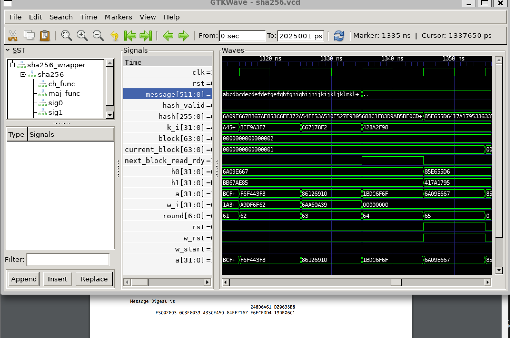

# SHA-256 Verilog Implementation

This project implements the SHA-256 cryptographic hash function in Verilog. It includes a modular design with separate modules for various components, as well as testbenches written in Python using Cocotb for simulation and verification.

---

## Project Structure

```
SHA256/
├── hdl/
│   ├── wrappers/
│   │   ├── wrapper.v       # Top-level wrapper for the SHA-256 modules
│   ├─ sha256.v             # Main SHA-256 implementation
├── tb/
│   ├── sha256_models.py    # Python models for verification
│   ├── tb_big_sigma_0.py   # Testbench for the Big Sigma 0 module
│   ├── tb_big_sigma_1.py   # Testbench for the Big Sigma 1 module
│   ├── tb_ch.py            # Testbench for the Ch module
│   ├── tb_maj.py           # Testbench for the Maj module
│   ├── tb_small_sigma_0.py # Testbench for the Small Sigma 0 module
│   ├── tb_small_sigma_1.py # Testbench for the Small Sigma 1 module
│   ├── tb_w_generator.py   # Testbench for the W generator module
│   ├── tb_w_new.py         # Testbench for the W_new module
│   ├── tb_sha256.py        # Testbench for the full SHA-256 module
├── Makefile                # Makefile for building and simulating the project
├── requirements.txt        # Python dependencies for Cocotb
├── sha256.vcd              # Value Change Dump for simulation waveforms
├── sha256config.gtkw       # GTKWave configuration file
```

---

## Prerequisites

Ensure the following tools are installed on your system:
- **Verilog Simulator:** [Icarus Verilog](http://iverilog.icarus.com/) or another simulator compatible with Cocotb.
- **Python:** Version 3.6+.
- **Cocotb:** [Cocotb library](https://docs.cocotb.org/en/stable/).
- **GTKWave:** For viewing simulation waveforms.

Install the Python dependencies using:
```bash
pip install -r requirements.txt
```

---

## Usage

### Build and Simulate

The `Makefile` provides targets for simulating each module individually or running all simulations. Below are the available targets:

1. **Simulate Individual Modules:**
   ```bash
   make small_sigma_0  # Simulate the Small Sigma 0 module
   make small_sigma_1  # Simulate the Small Sigma 1 module
   make big_sigma_0    # Simulate the Big Sigma 0 module
   make big_sigma_1    # Simulate the Big Sigma 1 module
   make ch             # Simulate the Ch module
   make maj            # Simulate the Maj module
   make w_new          # Simulate the W_new module
   make w_generator    # Simulate the W_generator module
   make sha256         # Simulate the full SHA-256 module
   ```

2. **Run All Tests:**
   ```bash
   make all            # Simulate all testbenches at once
   ```

### View Waveforms

After running a simulation, you can view the waveforms using GTKWave:
```bash
gtkwave sha256.vcd sha256config.gtkw
```

---

## Output

### Output of Single Block Data


### Output of Two Block Data



---

## Components

### Verilog Modules

- **Small Sigma 0 and 1:** Implements the small sigma functions used in the W schedule.
- **Big Sigma 0 and 1:** Implements the big sigma functions used in the compression function.
- **Ch:** Implements the choice function.
- **Maj:** Implements the majority function.
- **W_new:** Computes the next W value in the message schedule.
- **W_generator:** Generates the W schedule for 64 rounds.
- **SHA256:** Combines all components into the full SHA-256 algorithm.

### Testbenches

The Python testbenches in `tb/` validate each module against reference models. The `tb_sha256.py` testbench verifies the full implementation by comparing its output with Python's SHA-256 model.

---

## License

This project is released under the MIT License.

---

